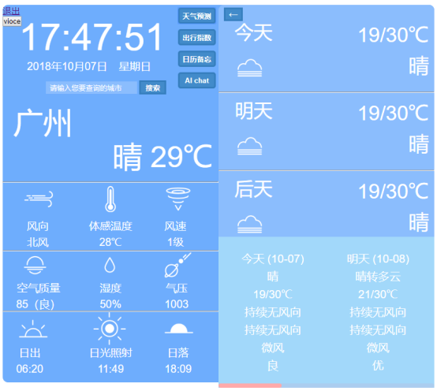
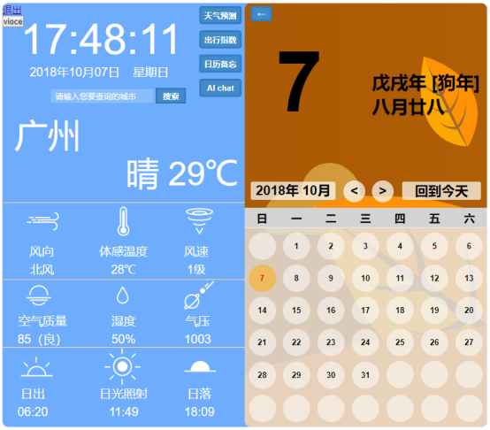
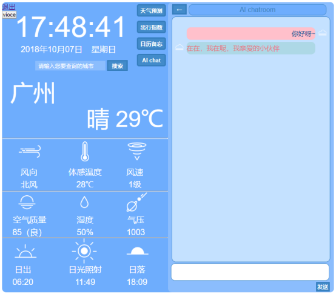

# weather
> requests

> mysql(pymysql、SQLAlchemy)

> flask

> HTML/CSS/JS(AJAX)

# Running the project
You can run the project using:

` python run.py `

# 项目图片

## 登陆、注册

## 主界面

## 功能界面

## 搜索功能

